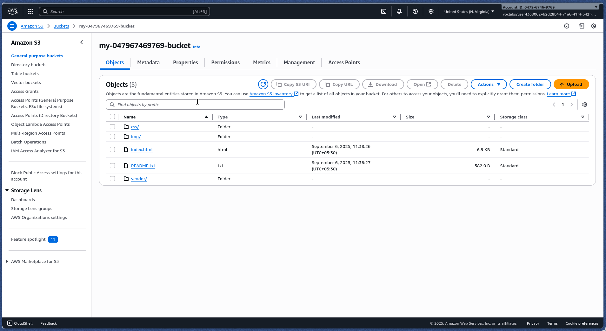
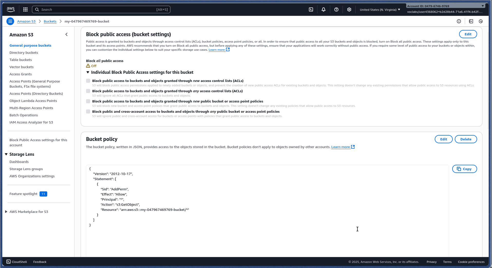
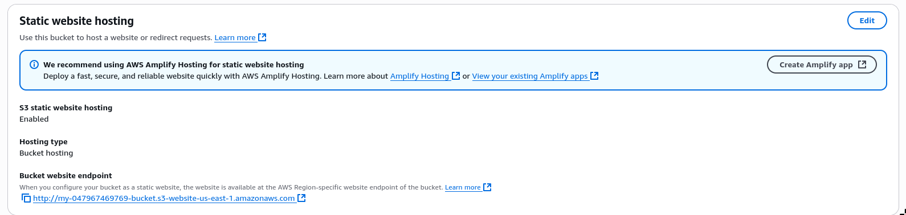
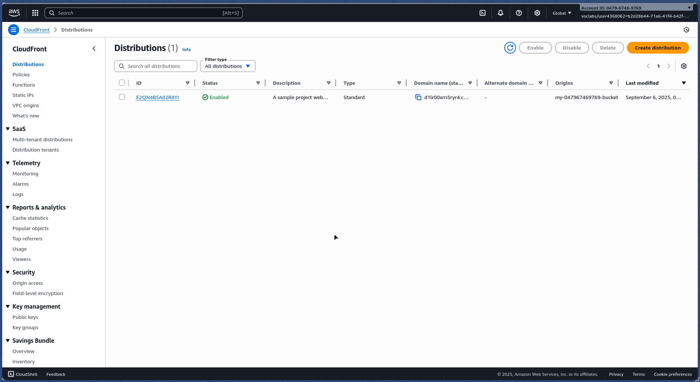

# UDACITY CLOUD PROJECT: PROJECT RUBRIC

    <strong>CloudFront Domain Name URL:</strong> d1lr00xrn5ryr4.cloudfront.net 
    <strong>Website-Endpoint URL:</strong> http://my-047967469769-bucket.s3-website-us-east-1.amazonaws.com/

## SCREENSHOTS

### S3 Bucket 

#### All Files 

#### Permissions 

#### Static Web-hosting Propery 

### CloudFront 

### Website running in the browser 

