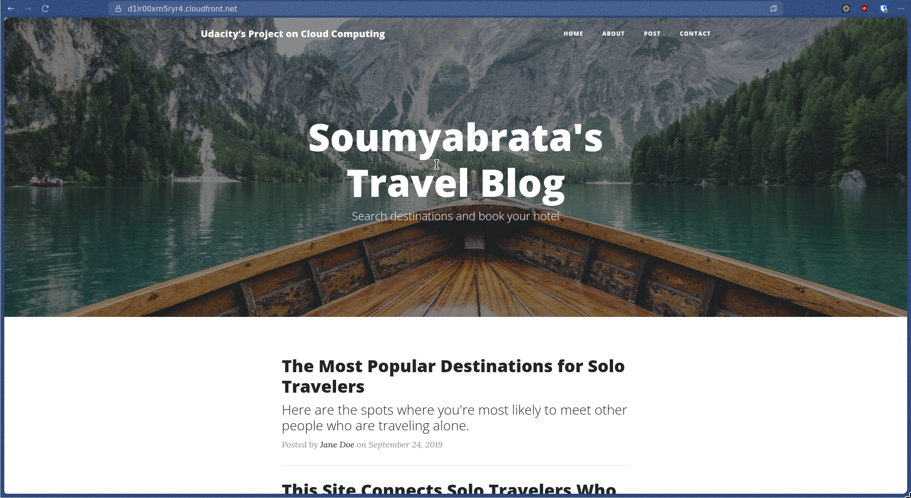

# UDACITY CLOUD PROJECT: PROJECT RUBRIC

**CloudFront Domain Name URL:** [d1lr00xrn5ryr4.cloudfront.net](https://d1lr00xrn5ryr4.cloudfront.net) 

**Website-Endpoint URL:** [my-047967469769-bucket.s3-website-us-east-1.amazonaws.com/](http://my-047967469769-bucket.s3-website-us-east-1.amazonaws.com/)

## ABOUT THE PROJECT 

Amazon Web Services or AWS is a popular cloud service that in itself provides numerous services. This is a simple project where we host a Static Web Site using AWS. In this small project, we create an S3 Bucket and store our static web site files in it. We then expose this bucket by allowing the static web hosting property provided by AWS for S3 Buckets. After that, we use CloudFront, another popular service provided by AWS, to distribute the website.

## SCREENSHOTS

### S3 Bucket 

#### All Files 

#### Permissions 

#### Static Web-hosting Property

### CloudFront 

#### Detailed Overview 

### Website running in the browser 

## CREDITS

The Background Image has been taken from [unsplash.com](https://unsplash.com/photos/brown-wooden-boat-moving-towards-the-mountain-O453M2Liufs).

All the code for the website has been obtained from the **Udacity Platform** with minor changes made from my part.
